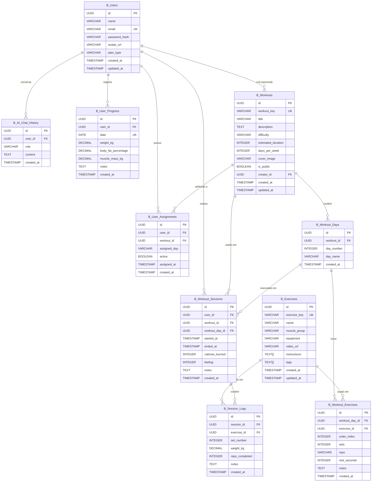
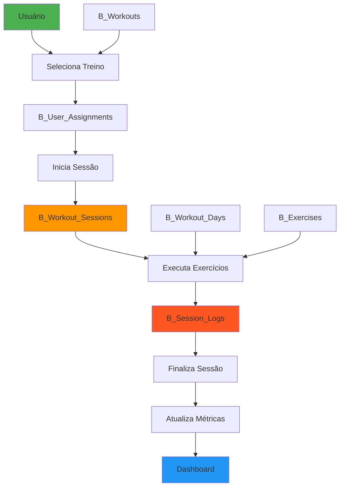

# BENFIT TREINOS - DIAGRAMA DO BANCO DE DADOS

## Diagrama Entidade-Relacionamento (ERD)



## Fluxo de Dados Principal



## Relacionamentos Detalhados

### 1. Gestão de Usuários
```
B_Users (1) ──────→ (N) B_User_Assignments
  └─ Um usuário pode ter múltiplos treinos atribuídos
  
B_Users (1) ──────→ (N) B_Workout_Sessions
  └─ Um usuário pode realizar múltiplas sessões de treino
  
B_Users (1) ──────→ (N) B_AI_Chat_History
  └─ Um usuário pode ter múltiplas conversas com o AI Coach
  
B_Users (1) ──────→ (N) B_User_Progress
  └─ Um usuário pode ter múltiplos registros de progresso
```

### 2. Estrutura de Treinos
```
B_Workouts (1) ───→ (N) B_Workout_Days
  └─ Um treino contém múltiplos dias
  
B_Workout_Days (1) → (N) B_Workout_Exercises
  └─ Um dia contém múltiplos exercícios
  
B_Exercises (1) ──→ (N) B_Workout_Exercises
  └─ Um exercício pode ser usado em múltiplos treinos
```

### 3. Execução e Logs
```
B_Workout_Sessions (1) → (N) B_Session_Logs
  └─ Uma sessão contém múltiplos logs de séries
  
B_Exercises (1) ──→ (N) B_Session_Logs
  └─ Um exercício pode ter múltiplos logs
```

## Índices Criados

### Tabela B_Users
- `idx_b_users_email` - Email (para login rápido)

### Tabela B_Exercises
- `idx_b_exercises_muscle_group` - Grupo muscular
- `idx_b_exercises_equipment` - Equipamento
- `idx_b_exercises_key` - Chave do exercício

### Tabela B_Workouts
- `idx_b_workouts_public` - Treinos públicos
- `idx_b_workouts_difficulty` - Dificuldade

### Tabela B_Workout_Days
- `idx_b_workout_days_workout` - ID do treino

### Tabela B_Workout_Exercises
- `idx_b_workout_exercises_day` - ID do dia
- `idx_b_workout_exercises_exercise` - ID do exercício

### Tabela B_User_Assignments
- `idx_b_user_assignments_user` - ID do usuário
- `idx_b_user_assignments_active` - Usuário + Status ativo

### Tabela B_Workout_Sessions
- `idx_b_workout_sessions_user` - ID do usuário
- `idx_b_workout_sessions_started` - Data de início
- `idx_b_workout_sessions_user_date` - Usuário + Data

### Tabela B_Session_Logs
- `idx_b_session_logs_session` - ID da sessão
- `idx_b_session_logs_exercise` - ID do exercício

### Tabela B_AI_Chat_History
- `idx_b_ai_chat_user` - Usuário + Data

### Tabela B_User_Progress
- `idx_b_user_progress_user_date` - Usuário + Data (DESC)

## Políticas de Segurança (RLS)

### Tabelas com RLS Habilitado:
- ✅ B_Users
- ✅ B_User_Assignments
- ✅ B_Workout_Sessions
- ✅ B_Session_Logs
- ✅ B_AI_Chat_History
- ✅ B_User_Progress

### Tabelas Públicas (Leitura):
- 📖 B_Exercises (todos podem ler)
- 📖 B_Workouts (públicos ou do criador)
- 📖 B_Workout_Days (todos podem ler)
- 📖 B_Workout_Exercises (todos podem ler)

## Triggers Automáticos

### Update Timestamps:
- `update_b_users_updated_at` - Atualiza B_Users.updated_at
- `update_b_exercises_updated_at` - Atualiza B_Exercises.updated_at
- `update_b_workouts_updated_at` - Atualiza B_Workouts.updated_at

## Constraints e Validações

### B_Users
- `plan_type` ∈ {'FREE', 'PRO', 'ELITE'}
- `email` UNIQUE

### B_Exercises
- `exercise_key` UNIQUE

### B_Workouts
- `workout_key` UNIQUE
- `difficulty` ∈ {'Iniciante', 'Intermediário', 'Avançado', 'Iniciante / Intermediário'}

### B_Workout_Days
- UNIQUE(workout_id, day_number)

### B_Workout_Exercises
- UNIQUE(workout_day_id, order_index)

### B_Workout_Sessions
- `feeling` BETWEEN 1 AND 10

### B_User_Progress
- UNIQUE(user_id, date)

### B_AI_Chat_History
- `role` ∈ {'user', 'assistant', 'system'}

## Tipos de Dados Especiais

### Arrays PostgreSQL:
- `B_Exercises.instructions` - TEXT[]
- `B_Exercises.tags` - TEXT[]

### Enums Simulados:
- `B_Users.plan_type` - VARCHAR com CHECK
- `B_Workouts.difficulty` - VARCHAR com CHECK
- `B_AI_Chat_History.role` - VARCHAR com CHECK

### Decimais:
- `B_Session_Logs.weight_kg` - DECIMAL(6, 2) - até 9999.99 kg
- `B_User_Progress.weight_kg` - DECIMAL(5, 2) - até 999.99 kg
- `B_User_Progress.body_fat_percentage` - DECIMAL(4, 2) - até 99.99%
- `B_User_Progress.muscle_mass_kg` - DECIMAL(5, 2) - até 999.99 kg

## Cardinalidade

```
B_Users (1) ──────────→ (0..N) B_User_Assignments
B_Users (1) ──────────→ (0..N) B_Workout_Sessions
B_Users (1) ──────────→ (0..N) B_AI_Chat_History
B_Users (1) ──────────→ (0..N) B_User_Progress
B_Users (0..1) ───────→ (0..N) B_Workouts

B_Workouts (1) ───────→ (1..N) B_Workout_Days
B_Workouts (1) ───────→ (0..N) B_User_Assignments
B_Workouts (1) ───────→ (0..N) B_Workout_Sessions

B_Workout_Days (1) ───→ (1..N) B_Workout_Exercises
B_Workout_Days (1) ───→ (0..N) B_Workout_Sessions

B_Exercises (1) ──────→ (0..N) B_Workout_Exercises
B_Exercises (1) ──────→ (0..N) B_Session_Logs

B_Workout_Sessions (1) → (0..N) B_Session_Logs
```

## Cascade Behaviors

### ON DELETE CASCADE:
- B_Workouts → B_Workout_Days
- B_Workout_Days → B_Workout_Exercises
- B_Users → B_User_Assignments
- B_Users → B_Workout_Sessions
- B_Users → B_AI_Chat_History
- B_Users → B_User_Progress
- B_Workout_Sessions → B_Session_Logs

### ON DELETE SET NULL:
- B_Users → B_Workouts (creator_id)
- B_Workout_Days → B_Workout_Sessions (workout_day_id)

---

**Legenda:**
- PK = Primary Key
- FK = Foreign Key
- UK = Unique Key
- (1) = Um
- (N) = Muitos
- (0..N) = Zero ou Muitos
- (1..N) = Um ou Muitos
