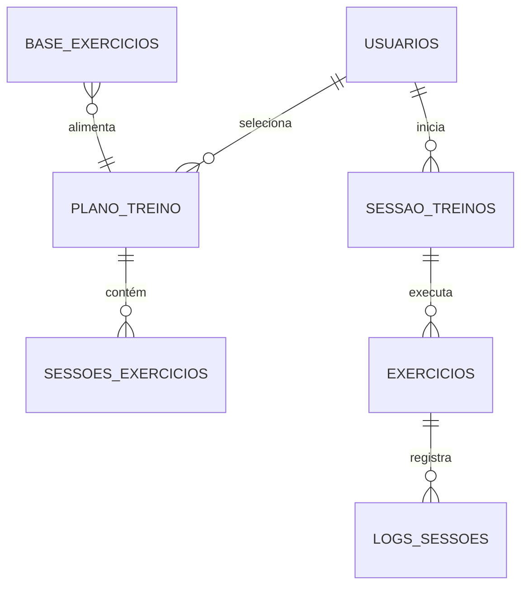

# Estrutura de Banco de Dados - Benfit Treinos

Esta documentação descreve a estrutura de dados sugerida para suportar as funcionalidades do aplicativo Benfit Treinos, incluindo gestão de usuários, treinos, exercícios e histórico de performance.

## Diagrama Relacional (Conceitual)


```
erDiagram
    USERS ||--o{ WORKOUT_PLANS : "possui"
    USERS ||--o{ WORKOUT_SESSIONS : "realiza"
    WORKOUT_PLANS ||--o{ WORKOUT_EXERCISES : "contém"
    EXERCISES ||--o{ WORKOUT_EXERCISES : "usado em"
    WORKOUT_SESSIONS ||--o{ SESSION_LOGS : "registra"
    EXERCISES ||--o{ SESSION_LOGS : "referencia"
```

## Tabelas Principais

### 1. `users` (Usuários)
Armazena as informações de conta e perfil do atleta.

| Campo | Tipo | Descrição |
|-------|------|-----------|
| `id` | UUID / INT | Chave primária única. |
| `name` | VARCHAR | Nome completo (ex: "João Silva"). |
| `email` | VARCHAR | Email para login. |
| `password_hash` | VARCHAR | Hash da senha (segurança). |
| `avatar_url` | VARCHAR | URL da foto de perfil. |
| `plan_type` | ENUM | Tipo de plano ('FREE', 'PRO', 'ELITE'). |
| `created_at` | TIMESTAMP | Data de cadastro. |

### 2. `exercises` (Biblioteca de Exercícios)
Catálogo de todos os exercícios disponíveis no sistema.

| Campo | Tipo | Descrição |
|-------|------|-----------|
| `id` | UUID / INT | Chave primária. |
| `name` | VARCHAR | Nome do exercício (ex: "Supino Reto"). |
| `muscle_group` | VARCHAR | Grupo muscular principal (ex: "Peito"). |
| `equipment` | VARCHAR | Equipamento necessário (ex: "Barra", "Halter"). |
| `video_url` | VARCHAR | Link para vídeo demonstrativo. |
| `instructions` | TEXT | Texto explicativo da execução. |

### 3. `workouts` (Modelos de Treino)
As fichas de treino criadas (ex: "Superiores A", "Leg Day").

| Campo | Tipo | Descrição |
|-------|------|-----------|
| `id` | UUID / INT | Chave primária. |
| `title` | VARCHAR | Título do treino (ex: "Superiores A"). |
| `description` | TEXT | Descrição ou foco do treino. |
| `difficulty` | ENUM | Nível ('Iniciante', 'Intermediário', 'Avançado'). |
| `estimated_duration`| INT | Duração estimada em minutos (ex: 60). |
| `cover_image` | VARCHAR | Imagem de capa do card de treino. |
| `is_public` | BOOLEAN | Se é um treino padrão do sistema ou personalizado. |
| `creator_id` | FK -> users | (Opcional) Se foi criado por um personal ou usuário. |

### 4. `workout_exercises` (Exercícios do Treino)
Tabela de ligação que define quais exercícios compõem um treino e sua prescrição.

| Campo | Tipo | Descrição |
|-------|------|-----------|
| `id` | UUID / INT | Chave primária. |
| `workout_id` | FK -> workouts| O treino ao qual pertence. |
| `exercise_id` | FK -> exercises| O exercício a ser realizado. |
| `order_index` | INT | Ordem do exercício no treino (1º, 2º...). |
| `sets` | INT | Número de séries prescritas (ex: 4). |
| `reps` | VARCHAR | Repetições prescritas (ex: "10-12"). |
| `rest_seconds` | INT | Tempo de descanso em segundos (ex: 60). |
| `notes` | TEXT | Observações específicas (ex: "Drop-set na última"). |

### 5. `user_assignments` (Agenda/Atribuições)
Define quais treinos o usuário deve fazer.

| Campo | Tipo | Descrição |
|-------|------|-----------|
| `id` | UUID / INT | Chave primária. |
| `user_id` | FK -> users | O usuário. |
| `workout_id` | FK -> workouts| O treino atribuído. |
| `assigned_day` | VARCHAR | Dia da semana sugerido (ex: "Segunda"). |
| `active` | BOOLEAN | Se este treino está na rotina atual. |

---

## Histórico e Analytics (Gamification)

### 6. `workout_sessions` (Sessões Realizadas)
Registra cada vez que um usuário inicia/finaliza um treino. Alimenta o card "Frequência" e "Calorias".

| Campo | Tipo | Descrição |
|-------|------|-----------|
| `id` | UUID / INT | Chave primária. |
| `user_id` | FK -> users | Quem treinou. |
| `workout_id` | FK -> workouts| Qual treino foi realizado. |
| `started_at` | TIMESTAMP | Hora de início. |
| `ended_at` | TIMESTAMP | Hora de fim. |
| `calories_burned` | INT | Calorias gastas (estimado ou input). |
| `feeling` | INT | Escala de esforço (1-10) ou satisfação. |

### 7. `session_logs` (Logs de Séries)
O registro detalhado do que foi feito. Alimenta o card "Volume Total".

| Campo | Tipo | Descrição |
|-------|------|-----------|
| `id` | UUID / INT | Chave primária. |
| `session_id` | FK -> sessions| A sessão de treino. |
| `exercise_id` | FK -> exercises| O exercício realizado. |
| `set_number` | INT | Qual série foi (1, 2, 3...). |
| `weight_kg` | FLOAT | Carga utilizada em kg. |
| `reps_completed` | INT | Repetições realizadas. |

---

## Gerenciamento de Imagens

### 8. `B_Avatars` (Biblioteca de Avatares e Imagens)
Centraliza todas as imagens de avatares e exercícios do aplicativo.

| Campo | Tipo | Descrição |
|-------|------|-----------|
| `id` | UUID | Chave primária. |
| `storage_path` | VARCHAR(500) | Caminho no storage bucket (ex: 'avatars/ana_feliz.png'). |
| `public_url` | VARCHAR(500) | URL pública da imagem. |
| `name` | VARCHAR(100) | Nome descritivo do avatar (ex: "Ana Feliz"). |
| `category` | VARCHAR(50) | Categoria ('3D', 'Real', 'Avatar', 'exercicio', etc.). |
| `tags` | TEXT[] | Array de tags para busca/filtro (ex: ['female', 'happy']). |
| `gender` | VARCHAR(20) | Gênero do avatar ('male', 'female', 'neutral'). |
| `is_active` | BOOLEAN | Se o avatar está ativo e visível para seleção. |
| `created_at` | TIMESTAMP | Data de criação. |

**Políticas RLS:**
- **SELECT**: Acesso público (qualquer um pode visualizar avatares).
- **INSERT/UPDATE/DELETE**: Apenas usuários autenticados podem gerenciar avatares.

**Funcionalidades:**
- Interface de gerenciamento disponível em Perfil > Aplicativo > Gerenciar Avatares
- Permite criar, editar e deletar avatares através de modal CRUD
- Suporta imagens locais (pasta `/public`) ou URLs externas (HTTPS)
- Sistema de categorização por tipo (Avatar, exercicio, 3D, Real)
- Tags personalizadas para facilitar busca e filtros

---

## Consultas para Dashboard (Exemplos)

Para preencher os cards da tela inicial:

1.  **Frequência (Últimos 7 dias)**:
    *   `SELECT COUNT(*) FROM workout_sessions WHERE user_id = ? AND started_at >= NOW() - INTERVAL '7 days'`

2.  **Calorias Queimadas (Total)**:
    *   `SELECT SUM(calories_burned) FROM workout_sessions WHERE user_id = ?`

3.  **Volume Total (Carga * Reps)**:
    *   `SELECT SUM(weight_kg * reps_completed) FROM session_logs JOIN workout_sessions ON ... WHERE user_id = ?`

4.  **Próximo Treino**:
    *   Baseado na tabela `user_assignments` e no dia da semana atual.
